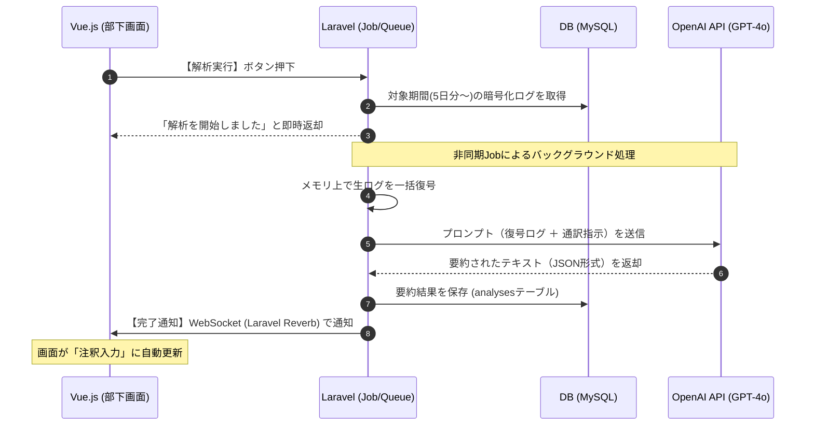

# アウトプット生成（AI要約）フェーズ：技術仕様書

## **1. 処理フロー（シーケンス図）**

## **2. 使用する技術スタック**

| **カテゴリ** | **技術・ライブラリ** | **役割** |
| --- | --- | --- |
| **Backend** | **Laravel 12 (Queue/Job)** | 重いAI処理を裏側で実行し、ユーザーを待たせない。 |
| **AI API** | **OpenAI API (GPT-4o)** | 2026年時点の最高精度モデル。「本音」を「改善提案」へ通訳する。 |
| **Security** | **Laravel Crypt (AES-256)** | 暗号化されたログを、解析の瞬間だけメモリ上で安全に復号する。 |
| **Real-time** | **Laravel Reverb** | 解析が終わった瞬間に、ブラウザへ完了をプッシュ通知する。 |

## 3. 実装のポイント

### ① 非同期処理（Queue/Job）の採用

AIの要約には10秒〜30秒程度の時間がかかります。これを通常の画面リクエストで行うとタイムアウトやフリーズの原因になるため、**Laravel Job** を活用して裏側で処理します。

- **ユーザー体験:** 実行ボタンを押した後、画面を閉じても解析は進み、終わったら通知が届きます。

### ② メモリ上での安全な復号

「秘匿性」を最優先するため、データベースに暗号化して保存されている「生の本音」は、**AIに渡す直前にメモリの中でのみ復号**します。

- **安全設計:** サーバー内のログファイルや一時ファイルに、復号された（読める状態の）生ログを残さない設計を徹底します。

### ③ Laravel Reverb によるリアルタイム通知

解析完了を検知するために画面を更新（リロード）する必要はありません。

- **自動遷移:** 2026年の最新標準である **Laravel Reverb** を使い、サーバーから「終わったよ」という信号を直接Vue.jsに送ります。これにより、解析が終わった瞬間に画面が「注釈入力モード」へスムーズに切り替わります。
