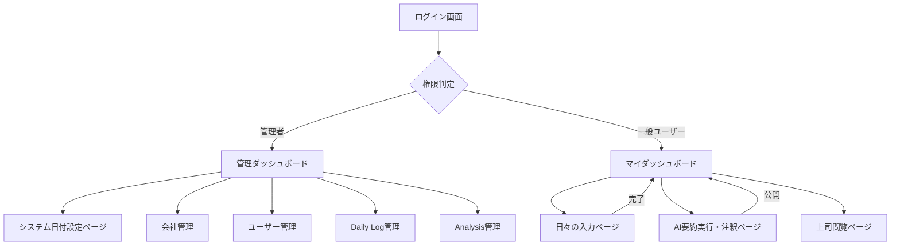

# ページ詳細

## **1. ページ遷移図 (Mermaid)**

## **2. ページ詳細と機能確認（最新版）**

### **■ システム管理者用（特権・保守）**

| **ページ名** | **主な機能** |
| --- | --- |
| **システム日付設定** | **最重要機能。** システム全体の「現在の日付」を操作し、入力漏れや期限切れへの対応を可能にする。 |
| **会社・ユーザー管理** | 所属企業の管理と、同企業内での上司選択を制御するためのユーザー紐付け。 |
| **Daily Log管理** | 全ユーザーの生ログの検索・編集・削除。唯一「生の言葉」にアクセスできる場所。 |
| **Analysis管理** | AIが作成した要約データの管理。トラブル時の削除や再生成用。 |

### **■ 一般ユーザー用（部下・上司）**

| **ページ名** | **主な機能** |
| --- | --- |
| **マイダッシュボード** | **入口。** 「今日の日記は済んでいるか」「要約（5日分）は溜まったか」「上司として読むべき未読レポートはあるか」を表示。 |
| **日々の入力** | **「余白」を拾う。** 音声・テキストで今日の本音を投稿。保存後は本人も内容を見ることができない（非可逆性の担保）。 |
| **AI要約実行・注釈** | **「通訳者」の確認。** 溜まったログをAIが要約し、そこに部下が補足（200字）を添えて、閲覧する上司を選択・公開する。 |
| **上司閲覧ページ** | **1on1の準備。** 部下から送られてきた要約＋注釈を閲覧。**公開から1週間を過ぎると一覧から消える**限定アクセス。 |
